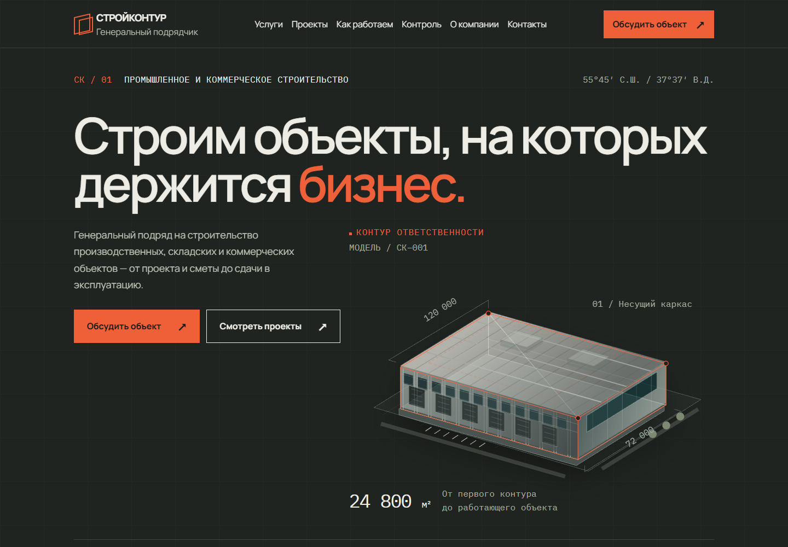

# СТРОЙКОНТУР

Адаптивный сайт генерального подрядчика: промышленное и коммерческое строительство в Москве, Московской области и ЦФО. Архитектурная графика, интерактивная подача услуг и проектов, форма предварительной оценки объекта.

**[Открыть сайт →](https://zengord.github.io/stroykontur/)** · [Портфолио автора](https://zengord.github.io/portfolio/)



## Возможности сайта

- Первый экран с SVG-моделью здания и анимацией построения.
- Показатели компании с анимированными счётчиками.
- Шесть направлений строительства с адаптивными вкладками.
- Слайдер проектов с описаниями и характеристиками объектов.
- Семь этапов работы и интерактивная графика контроля строительства.
- Документы компании и скачиваемые PDF.
- Форма заявки: маска телефона, валидация, выбор файлов и drag-and-drop.
- FAQ, контакты, мобильное меню и плавная навигация по разделам.
- Политика конфиденциальности на отдельной странице и в модальном окне.

Интерфейс на русском языке. Сайт адаптирован для компьютеров, планшетов и телефонов. Шрифты Manrope и IBM Plex Mono подключены локально; предусмотрены клавиатурная навигация и уменьшение анимации при `prefers-reduced-motion`.

## Технологии

HTML, CSS и JavaScript. Сайт разработан с использованием SCSS, Vite 8 и FLS Start 4; слайдер проектов работает на Swiper.

В этом репозитории опубликована **готовая статическая сборка**. Исходники стартового шаблона, сборочная инфраструктура, зависимости и файлы для отладки сюда не включены.

## Содержимое репозитория

```text
index.html          # Главная страница
privacy.html        # Политика конфиденциальности
css/                # Стили собранного сайта
js/                 # Скрипты собранного сайта
assets/             # Изображения и локальные шрифты
files/              # PDF, брендовые материалы и лицензии шрифтов
docs/images/        # Превью для README
robots.txt          # Правила индексации
sitemap.xml         # Карта сайта
.nojekyll           # Публикация статических файлов без Jekyll
```

## Просмотр локально

Сайт не требует установки npm-зависимостей или повторной сборки. Для корректной работы модульных скриптов запускайте его через HTTP-сервер:

```bash
git clone https://github.com/Zengord/stroykontur.git
cd stroykontur
python -m http.server 8000
```

Откройте [http://localhost:8000](http://localhost:8000). Также подойдёт любой сервер статических файлов, например Live Server.

## GitHub Pages

Публичный адрес: **[zengord.github.io/stroykontur](https://zengord.github.io/stroykontur/)**.

GitHub Pages публикует корень ветки `main`. После обновления готовых файлов в этой ветке сайт обновляется автоматически. Параметры репозитория: **Settings → Pages → Deploy from a branch → main → / (root)**.

Пути к ресурсам относительные, поэтому сайт работает в подкаталоге `/stroykontur/`. Canonical, Open Graph, структурированные данные и sitemap настроены на адрес опубликованного сайта.

## Форма заявки

GitHub Pages обслуживает статические файлы и не запускает сервер обработки заявок. В опубликованной версии форма валидирует поля и вложения, показывает состояния отправки, но **не отправляет и не сохраняет данные**: используется имитация ответа.

Для реального приёма заявок нужен внешний endpoint. Форма поддерживает `data-request-endpoint`: транспорт отправляет `POST multipart/form-data` и ожидает HTTP 2xx с JSON `{ "success": true }`. Сервис на другом домене должен разрешать CORS для адреса сайта.

Ограничения вложений: до пяти файлов, суммарно 50 МиБ, форматы PDF, DWG, XLSX, DOCX и ZIP. Сервер должен повторно проверять файлы и ограничения.

## Проверки перед публикацией

Production-сборка успешно прошла. В браузере проверены ширины от 320 до 1920 px, меню, вкладки, слайдер проектов, FAQ, политика конфиденциальности, валидация формы и загрузка файлов. На проверенной сборке не обнаружены ошибки JavaScript, недоступные ресурсы и горизонтальная прокрутка.
